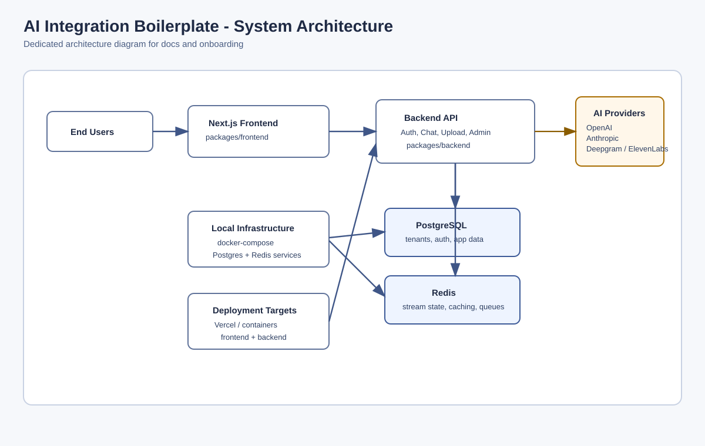

# AI Integration Boilerplate

Ship your AI SaaS faster, without starting from a blank screen.

This is a ready-to-run app foundation for teams that want to launch an AI product with sign-in, billing-ready account boundaries, chat, file upload, and admin settings already wired.

## Looking For The Short Version?

For a one-screen, marketplace-style overview with a stronger call to action, see [README.marketplace.md](README.marketplace.md).

## What This Is

AI Integration Boilerplate is a complete starting point for an AI web product: backend, frontend, database, and local infrastructure in one repo.

You buy this when you want to spend your time on your product idea, not on rebuilding login, permissions, upload flows, or deployment glue.

## Who This Is For

- Founders who need to get to a demo or paying customer quickly.
- Product teams building an internal AI tool for multiple departments or clients.
- Agencies that want a reusable base they can adapt for client projects.
- Developers who are tired of stitching 12 templates together before writing real product code.

## The Problem It Solves

Most teams lose early momentum on setup work that users never see: auth, data safety boundaries, background jobs, and admin pages.

This boilerplate gives you those building blocks from day one so your first week goes into customer-facing features, not plumbing.

## Setup: What It Actually Takes

If your machine already has Node, pnpm, and Docker, setup is usually 15 to 25 minutes.

1. Clone the repo.
2. Install dependencies with pnpm install.
3. Copy the env examples.
4. Start local services with docker compose up -d.
5. Generate keys with pnpm --filter backend run generate-keys.
6. Start the app with pnpm dev.

After that, you open:

- Frontend: http://localhost:3000
- Backend: http://localhost:3001

## What You Get On Day One (And Why You Should Care)

- Ready sign-up and login flow, so you can onboard real users immediately instead of delaying launch with auth rewrites.
- Team/account data boundaries, so one customer cannot see another customer's data and you can sell to serious buyers with confidence.
- Streaming chat UI and API, so your product feels responsive and modern instead of slow and batch-like.
- File upload and document processing flow, so users can bring their own content and get value from their data right away.
- Provider settings per account, so each customer can connect their own AI keys and you avoid one-size-fits-all limits.
- Session management page, so admins can revoke access quickly when laptops are lost or users leave.
- Health and diagnostics endpoints, so you can spot outages early and fix problems before customers complain.
- PostgreSQL and Redis wired for local development, so your team runs the same stack and avoids "works on my machine" chaos.
- Docker and deploy-ready project structure, so moving from local to cloud is straightforward when you are ready.

## What Is Not Included

- No hosted service: this is code you run in your own environment.
- No done-for-you product strategy: you still decide your niche, pricing, and user experience.
- No guaranteed compliance certifications out of the box: you must do your own legal and security review for your market.
- No custom integrations for your specific business systems: you add those based on your customer needs.
- No automatic production support plan: your team owns operations unless you add your own support layer.

## Is It A Fit?

This is a fit if you want to launch faster with a solid base and you are comfortable owning your own code.

It is not a fit if you want a no-code product builder or a fully managed SaaS where someone else runs everything.

## System Architecture Diagram



- Editable source: [docs/system-architecture.mmd](docs/system-architecture.mmd)
- Dedicated image file: [docs/system-architecture.svg](docs/system-architecture.svg)

## Quick Start Commands

```bash
pnpm install
cp .env.example .env
cp packages/backend/.env.example packages/backend/.env
cp packages/frontend/.env.example packages/frontend/.env.local
docker compose up -d
pnpm --filter backend run generate-keys
pnpm dev
```

Windows PowerShell env copy:

```powershell
Copy-Item .env.example .env
Copy-Item packages/backend/.env.example packages/backend/.env
Copy-Item packages/frontend/.env.example packages/frontend/.env.local
```

---

If your goal is to get from idea to working AI product in days, this gives you a serious head start.
